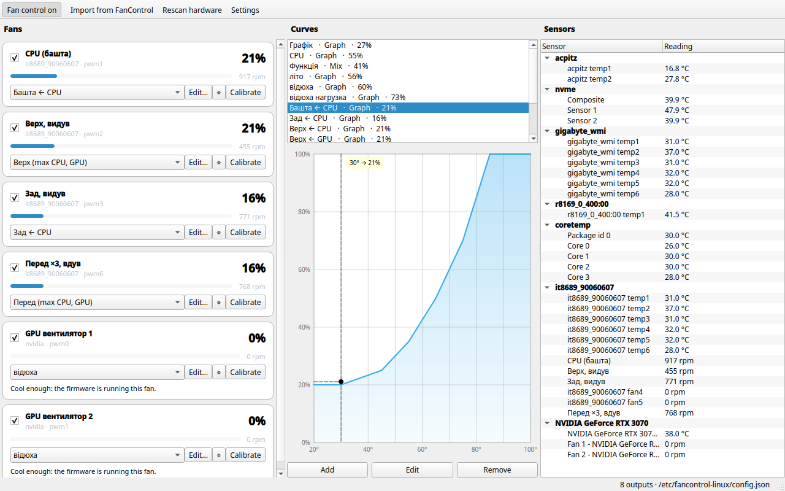

# fancontrol-linux

Керування вентиляторами для Linux — у дусі
[FanControl](https://github.com/Rem0o/FanControl.Releases) для Windows, але
без .NET: демон на Python, який пише в `hwmon`, і вікно на Qt6, яке рідно
виглядає в KDE Plasma.

Головне: **читає ваш `userConfig.json` з Windows-версії FanControl** і сам
зіставляє залізо з тим, що бачить Linux.



---

## Що вміє

* **Криві** — усі сім типів, що є у FanControl:
  * `Графік` — точки, які ви ставите мишею
  * `Фіксована швидкість` — одне значення
  * `Лінійна` — рампа між двома температурами
  * `Цільова температура` — тримає задану температуру, а не мапить її у відсотки
  * `Тригер` — дві швидкості з проміжком між порогами, щоб кулер не «сіпався»
  * `Мікс` — комбінує інші криві (максимум / мінімум / середнє / сума / різниця)
  * `Синхронізація` — повторює інший вентилятор зі зсувом чи множником
* **Згладжування** — гістерезис і час відгуку **окремо для нагріву й
  охолодження**: реагувати на стрибок температури миттєво, а сповільнюватись
  повільно. Плюс «ігнорувати гістерезис за краями кривої».
* **Налаштування на кожен вентилятор** — мінімум, максимум, зсув, поріг
  зупинки, стартовий поштовх, обмеження швидкості наростання й спаду.
* **Калібрування** — програма сама розганяє й гальмує вентилятор, знаходить, на
  скількох відсотках він зупиняється й на скількох стартує, і пропонує
  відповідні мінімум і старт.
* **Безпека**:
  * якщо датчик, потрібний кривій, зник — вентилятор іде на запасне значення
    (за замовчуванням 100%), а не залишається на останньому;
  * вище критичної температури всі керовані вентилятори йдуть на 100%;
  * при зупинці демона всі `pwm*_enable` повертаються до значень, які там були
    до нас — тобто керування повертається прошивці материнки;
  * якщо тахометр показує 0 об/хв, поки вентилятор жене, — це видно в
    інтерфейсі як «застряг».
* **Залізо** — материнські чипи через `hwmon` (Nuvoton, ITE тощо), `amdgpu`,
  `k10temp`/`coretemp`, NVMe, і відеокарти NVIDIA через NVML.

---

## Встановлення (Fedora 44, KDE Plasma)

```bash
git clone https://github.com/4bit33/Fancontrol-linux.git
cd Fancontrol-linux
sudo ./install.sh
```

Скрипт поставить залежності (`python3-dasbus`, `python3-pyside6`), сам пакет,
`systemd`-юніт, політику D-Bus і пункт у меню, а потім увімкне демон.

### Перевірка, чи взагалі все на місці

```bash
fanctl doctor
```

Показує знайдені чипи, чи є в них PWM-виходи, чи вони доступні на запис, які
модулі завантажені, стан NVIDIA і демона. Це перше, що варто запустити, якщо
щось не працює — і те, що варто прикласти до повідомлення про помилку.

### Якщо вентиляторів не видно

Це найчастіша проблема, і вона не в програмі: ядро ще не знає про super-I/O чип
материнки.

```bash
sudo sensors-detect        # погоджуйтесь на безпечні варіанти за замовчуванням
sudo modprobe nct6775      # або той модуль, який назве sensors-detect
sudo fanctl rescan
```

Щоб модуль вантажився при старті:

```bash
echo nct6775 | sudo tee /etc/modules-load.d/fancontrol.conf
```

На багатьох платах (особливо Gigabyte з чипами ITE — `it8688e`, `it8689e`)
ACPI тримає ці порти, і драйвер `it87` відмовляється вантажитись із
`Device or resource busy`. Тоді потрібен параметр ядра:

```bash
sudo grubby --update-kernel=ALL --args="acpi_enforce_resources=lax"
```

Це знімає захист ядра від одночасного доступу ACPI й драйвера до тих самих
портів. Зазвичай працює без проблем, але ризик не нульовий — вирішуйте самі.

Якщо `it87` не знає вашого чипа, є позаядерна версія з ширшою підтримкою:
[frankcrawford/it87](https://github.com/frankcrawford/it87) (ставиться через
`akmod`).

---

## Імпорт налаштувань із Windows

```bash
fanctl import ~/userConfig.json          # тільки показати, що вийде
fanctl import ~/userConfig.json --apply  # застосувати
```

Або у вікні: **Import from FanControl…**

### Що саме переноситься

Формат FanControl мінявся між версіями, тому імпортер не розраховує на одну
схему, а шукає об'єкти **структурно**. Перевірено на справжньому
`userConfig.json` версії 270 (він лежить у `tests/data/` як регресійний тест):

* точки кривих у всіх трьох виглядах — рядки `"20.4,21.0"` (v270), словник
  `{"30": 20}` і об'єкти `[{"X": 30, "Y": 20}]`;
* посилання на криві за GUID, за іменем і як `{"Name": "…"}`;
* гістерезис і час відгуку **окремо для нагріву й охолодження**
  (`HysteresisConfig`), разом з «ігнорувати на краях кривої»;
* діапазон осі графіка — крива для відеокарти до 120 °C лишається такою;
* прив'язка тахометра до конкретного роз'єму (`PairedFanSensor`) — береться з
  файлу, а не вгадується;
* `SelectedStart` / `SelectedStop` — точки старту й зупинки вентилятора;
* таблиця калібрування (`Calibration`) — переноситься й показується в
  налаштуваннях вентилятора.

### Як зіставляється залізо

FanControl зберігає ідентифікатори у форматі LibreHardwareMonitor
(`/lpc/it8689e/control/0`), а для NVIDIA — у власному
(`NVApiWrapper/0-GA104-A/control/0`). Для Linux вони нічого не означають:

| З Windows | Стає на Linux | Як здогадались |
|---|---|---|
| `/lpc/it8689e/control/0` | `hwmon:it8689-…:pwm1` | та сама мікросхема; LHM рахує з нуля, hwmon — з одиниці |
| `/lpc/it8689e/fan/0` | `hwmon:it8689-…:fan1` | те саме для тахометрів |
| `/amdcpu/0/temperature/2` | `hwmon:k10temp-…:temp1` | `amdcpu` → `k10temp`, канал із міткою `Tctl` |
| `NVApiWrapper/0-GA104-A/control/1` | `nvidia:GPU-…:pwm1` | відеокарта NVIDIA через NVML, збігається номер вентилятора |

Кожному варіанту виставляється оцінка впевненості. Автоматично застосовуються
тільки ті, де переможець і впевнений, і помітно попереду наступного.

**Свідомо не вгадуємо наосліп:**

* якщо два кандидати рівні — поле лишається порожнім;
* якщо два різні Windows-датчики претендують на **один** Linux-датчик, обидва
  йдуть на ручний вибір. Так буває з Intel: `/intelcpu/0/temperature/0` і
  `/1` обидва найкраще підходять до `Package id 0`, але це були різні датчики,
  тож щонайбільше один із них правильний;
* що не вдалося зіставити — імпортується, але лишається вимкненим, і в
  повідомленні пишеться **чому саме** (немає виходу на це залізо чи в кривої
  ще немає джерела температури).

Єдине, що не можна підтвердити з самого файлу, — це порядок нумерації функцій
мікс-кривої. Тому імпорт такої кривої завжди залишає попередження на кшталт
«збережено як функцію номер 2, прочитано як average — варто звірити з
FanControl».

---

## Користування

### Вікно

```bash
fancontrol-gui
```

Зліва вентилятори, посередині криві, справа датчики. Перемикач
**Fan control on** у панелі інструментів віддає вентилятори назад прошивці —
зручно, коли треба швидко перевірити, чи проблема у вашій кривій.

У графіку: тягніть точку мишею, подвійний клац — додати точку, права кнопка —
прибрати.

Датчики можна перейменовувати подвійним кліком — імена зберігаються в конфігу.

### Термінал

```bash
fanctl doctor                    # чи взагалі може працювати на цій машині
fanctl status                    # що зараз роблять вентилятори
fanctl list                      # усе знайдене залізо
fanctl set "CPU cooler" 60       # покрутити вручну
fanctl auto "CPU cooler"         # повернути під криву
fanctl calibrate "CPU cooler"    # виміряти старт і зупинку
fanctl disable                   # віддати вентилятори прошивці
fanctl config -o backup.json     # зберегти конфіг
```

---

## Спробувати без ризику

Є симулятор заліза: він створює дерево, схоже на `/sys/class/hwmon`, і
відповідає на запис PWM так, як відповідала б справжня система — температура
падає, коли вентилятори розкручуються.

```bash
fancontrol-sim --root /tmp/fake-hwmon &
FANCONTROL_HWMON_ROOT=/tmp/fake-hwmon \
FANCONTROL_DISABLE=nvidia \
FANCONTROL_CONFIG=/tmp/fake-config.json \
  fancontrol-gui --local
```

Жоден справжній вентилятор при цьому не чіпається.

---

## Як воно влаштоване

```
fancontrol-gui ──D-Bus──► fancontrold ──► /sys/class/hwmon/*/pwm*
   (ваш юзер)      │        (root)     └─► NVML (libnvidia-ml.so)
                   │
                fanctl
```

Демон працює під root, бо запис у PWM цього вимагає. Вікно працює від вашого
користувача й спілкується з ним через системну шину D-Bus
(`org.fancontrol.Daemon`). Читати статус може будь-хто; змінювати
налаштування — тільки члени групи `wheel` (це задається в
`data/dbus/org.fancontrol.Daemon.conf`).

Детальніше — у [docs/ARCHITECTURE.md](docs/ARCHITECTURE.md).

### Файли

| Що | Де |
|---|---|
| Конфігурація | `/etc/fancontrol-linux/config.json` |
| Резервна копія | `/etc/fancontrol-linux/config.json.bak` |
| systemd-юніт | `/usr/lib/systemd/system/fancontrold.service` |
| Політика D-Bus | `/usr/share/dbus-1/system.d/org.fancontrol.Daemon.conf` |

Конфіг — звичайний JSON, його можна редагувати руками; `sudo systemctl reload
fancontrold` перечитає його.

---

## Розробка

```bash
python3 -m pip install -e '.[dev,gui,daemon]'
python3 -m pytest              # 161 тест, справжнє залізо не потрібне
```

Тести ганяють криві, імпортер на **справжньому** `userConfig.json` версії 270,
движок на симуляторі (включно з наскрізним «машина реально охолоджується»),
сигнатури D-Bus-інтерфейсу, повний життєвий цикл демона на справжній шині
(запуск, SIGTERM, повернення керування прошивці) і GUI під offscreen-платформою
Qt.

---

## Ліцензія

GPL-3.0-or-later.
