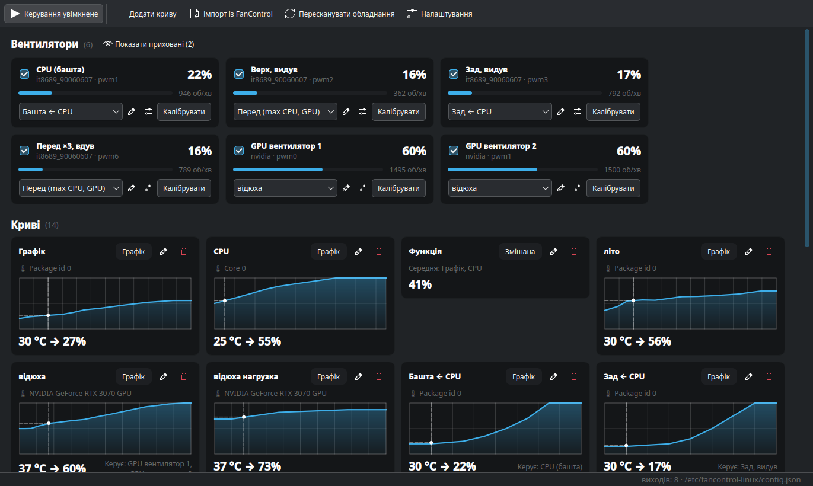

# fancontrol-linux

[English](README.md) · **Українська**

Керування вентиляторами для Linux — у дусі
[FanControl](https://github.com/Rem0o/FanControl.Releases) для Windows, але
без .NET: демон на Python, який пише в `hwmon`, і вікно на Qt6, яке рідно
виглядає в KDE Plasma.

Головне: **читає ваш `userConfig.json` з Windows-версії FanControl** і сам
зіставляє залізо з тим, що бачить Linux.



---

## Що вміє

* **Криві** — усі сім типів, що є у FanControl:
  * `Графік` — точки, які ви ставите мишею
  * `Фіксована швидкість` — одне значення
  * `Лінійна` — рампа між двома температурами
  * `Цільова температура` — тримає задану температуру, а не мапить її у відсотки
  * `Тригер` — дві швидкості з проміжком між порогами, щоб кулер не «сіпався»
  * `Мікс` — комбінує інші криві (максимум / мінімум / середнє / сума / різниця)
  * `Синхронізація` — повторює інший вентилятор зі зсувом чи множником
* **Згладжування** — гістерезис і час відгуку **окремо для нагріву й
  охолодження**: реагувати на стрибок температури миттєво, а сповільнюватись
  повільно. Плюс «ігнорувати гістерезис за краями кривої».
* **Налаштування на кожен вентилятор** — мінімум, максимум, зсув, поріг
  зупинки, стартовий поштовх, обмеження швидкості наростання й спаду.
* **Прошивка керує, поки холодно** — нижче заданої температури вентилятор
  віддається прошивці. Для відеокарти це її власна крива разом із зупинкою
  вентиляторів у простої; з порогу керування перебирає програма.
* **Калібрування** — програма сама розганяє й гальмує вентилятор, чекає, поки
  оберти устояться на кожному кроці, знаходить, де він зупиняється й де
  стартує, і пропонує мінімум, старт і поріг зупинки. Працює у фоні.
* **Безпека**:
  * якщо датчик, потрібний кривій, зник — вентилятор іде на запасне значення
    (за замовчуванням 100%), а не залишається на останньому;
  * вище критичної температури всі керовані вентилятори йдуть на 100%;
  * при зупинці демона всі `pwm*_enable` повертаються до значень, які там були
    до нас — тобто керування повертається прошивці материнки;
  * якщо демон убили (а не зупинили) — наступний запуск усе одно віддасть
    захоплені виходи прошивці, бо він записує їх у `/run`;
  * якщо тахометр показує 0 об/хв, поки вентилятор жене, — це видно в
    інтерфейсі як «застряг».
* **Залізо** — материнські чипи через `hwmon` (Nuvoton, ITE тощо), `amdgpu`,
  `k10temp`/`coretemp`, NVMe, і відеокарти NVIDIA через NVML.

---

## Що перевірено, а що ні

Чесно, щоб ви знали, на що розраховувати.

**Перевірено наживо** — на одній машині:

| | |
|---|---|
| Плата | Gigabyte B760 Gaming X AX DDR4, чип ITE IT8689E, позаядерний драйвер `it87` |
| Процесор | Intel (`coretemp`) |
| Відеокарта | NVIDIA GeForce RTX 3070, драйвер 610 |
| Система | Fedora 44, KDE Plasma (Wayland), SELinux enforcing |

Там працює все: чотири вентилятори плати, обидва вентилятори відеокарти,
калібрування, імпорт справжнього Windows-конфігу, повне встановлення зі
службою.

**Перевірено автоматично, без справжнього заліза:**

* 171 тест на кожен пуш, на Ubuntu і Fedora — криві, імпорт, рушій на
  симуляторі заліза, D-Bus, життєвий цикл демона, вікно;
* встановлення програми (без служби) у чистих контейнерах Fedora 44,
  Ubuntu 24.04, Debian trixie, Arch і openSUSE Tumbleweed.

**Не перевірено наживо:** чипи Nuvoton (`nct6775`), процесори й відеокарти AMD,
інші відеокарти NVIDIA, повне встановлення зі службою на дистрибутивах, крім
Fedora. Код для них той самий і має працювати — але «має» ще не «працює».

**Не підтримується:** AIO-помпи й контролери з USB (Corsair, NZXT тощо —
`liquidctl`), дистрибутиви без systemd.

### Якщо у вас інше залізо — розкажіть

Найкорисніше, що можна зробити для проєкту, — запустити на своїй машині й
відкрити [issue](../../issues/new?template=hardware-report.md), навіть якщо все
працює:

```bash
fanctl doctor
sudo ./tools/pwm-check.sh
```

Шаблон issue підкаже, що ще вказати.

---

## Встановлення

```bash
git clone https://github.com/4bit33/Fancontrol-linux.git
cd Fancontrol-linux
sudo ./install.sh
```

Скрипт знає `dnf` (Fedora), `apt` (Debian, Ubuntu), `pacman` (Arch) і
`zypper` (openSUSE). Він поставить із репозиторіїв дистрибутива те, що там є,
а PySide6 і dasbus, яких у деяких дистрибутивах немає, докачає з PyPI у власне
оточення програми — системний Python не зачіпається. Далі — `systemd`-юніт,
політика D-Bus, пункт у меню, і демон увімкнеться.

Потрібен systemd. Змінювати налаштування вентиляторів можуть члени групи
адміністраторів — `wheel` (Fedora, Arch, openSUSE) або `sudo` (Debian, Ubuntu);
інсталятор сам бере ту, що є на машині. Дивитись статус може будь-хто.

```bash
sudo ./install.sh --uninstall        # прибрати (конфіг лишиться в /etc)
```

### Оновлення

```bash
cd Fancontrol-linux && git pull && sudo ./install.sh
```

Налаштування зберігаються. Коли виходить нова версія, вікно про це скаже й
дасть скопіювати цю команду: раз на день воно питає GitHub, яка версія
найновіша. Саме нічого не завантажує й не встановлює — демон працює від root,
і таке рішення має ухвалювати людина, а не фоновий процес. Перевірку можна
вимкнути в Налаштуваннях.

---

## Перші кроки

1. **Перевірка, чи взагалі все на місці:**

   ```bash
   fanctl doctor
   ```

   Показує знайдені чипи, чи є в них PWM-виходи, які модулі завантажені, стан
   NVIDIA і демона. Якщо щось не так — див. [Якщо не працює](#якщо-не-працює).

2. **Який вентилятор на якому каналі.** Номери `pwm1..pwmN` нічого не кажуть
   про те, де вентилятор стоїть. Скрипт по черзі розкручує канали й дивиться,
   який тахометр зреагував — порожні роз'єми теж видно, а наприкінці все
   повертається як було:

   ```bash
   sudo ./tools/identify-fans.sh
   ```

3. **Налаштування** — імпорт із Windows (див. нижче) або з нуля у вікні
   `fancontrol-gui`.

4. **Калібрування** кожного вентилятора — кілька хвилин на кожен:

   ```bash
   fanctl calibrate "Назва вентилятора"
   ```

---

## Користування

### Вікно

```bash
fancontrol-gui
```

Одна сторінка карток, як у FanControl: **Вентилятори** (картка на кожен),
**Криві** (картка з маленьким графіком і тим, що крива видає зараз; клацніть,
щоб змінити, або по пунктирній картці, щоб додати), далі **Температури** й
**Оберти вентиляторів**. Перемикач **Керування увімкнене** в панелі
інструментів віддає вентилятори назад прошивці — зручно, коли треба швидко
перевірити, чи проблема у вашій кривій.

У графіку: тягніть точку мишею, подвійний клац — додати точку, права кнопка —
прибрати. ⚙ на картці вентилятора — мінімум, старт, обмеження швидкості і
поріг, нижче якого керує прошивка. Датчики можна перейменовувати подвійним
кліком.

Правий клік по будь-якій картці — «Приховати»: непотрібна крива, датчик, на
який ви не дивитесь, порожній роз'єм вентилятора. Це лише прибирає вікно —
прихована крива й далі керує своїми вентиляторами. Повернути можна кнопкою
**Показати приховані** в заголовку розділу.

Мова вікна — українська на українській системі, інакше англійська. Вибрати
самому: у **Налаштуваннях** (зберігається для вашого користувача) або
`fancontrol-gui --lang en` чи `FANCONTROL_LANG=uk`. Нова мова — це
один файл у `fancontrol/gui/locales/`; `tests/test_i18n.py` підкаже, яких
рядків бракує.

### Термінал

```bash
fanctl doctor                    # чи взагалі може працювати на цій машині
fanctl status                    # що зараз роблять вентилятори
fanctl list                      # усе знайдене залізо
fanctl set "CPU cooler" 60       # покрутити вручну
fanctl auto "CPU cooler"         # повернути під криву
fanctl calibrate "CPU cooler"    # виміряти старт і зупинку
fanctl disable                   # віддати вентилятори прошивці
fanctl config -o backup.json     # зберегти конфіг
```

---

## Імпорт налаштувань із Windows

```bash
fanctl import ~/userConfig.json          # тільки показати, що вийде
fanctl import ~/userConfig.json --apply  # застосувати
```

Або у вікні: **Import from FanControl…** — там же можна вибрати відповідність
для датчиків, які програма не зіставила сама.

### Що саме переноситься

Формат FanControl мінявся між версіями, тому імпортер не розраховує на одну
схему, а шукає об'єкти **структурно**. Перевірено на справжньому
`userConfig.json` версії 270 (він лежить у `tests/data/` як регресійний тест):

* точки кривих у всіх трьох виглядах — рядки `"20.4,21.0"` (v270), словник
  `{"30": 20}` і об'єкти `[{"X": 30, "Y": 20}]`;
* посилання на криві за GUID, за іменем і як `{"Name": "…"}`;
* гістерезис і час відгуку **окремо для нагріву й охолодження**
  (`HysteresisConfig`), разом з «ігнорувати на краях кривої»;
* діапазон осі графіка — крива для відеокарти до 120 °C лишається такою;
* прив'язка тахометра до конкретного роз'єму (`PairedFanSensor`);
* `SelectedStart` / `SelectedStop` — точки старту й зупинки вентилятора;
* таблиця калібрування (`Calibration`).

Якщо ви з того часу переставляли вентилятори, калібрування з Windows описує
стару розводку — варто відкалібрувати заново.

### Як зіставляється залізо

FanControl зберігає ідентифікатори у форматі LibreHardwareMonitor
(`/lpc/it8689e/control/0`), а для NVIDIA — у власному
(`NVApiWrapper/0-GA104-A/control/0`). Для Linux вони нічого не означають:

| З Windows | Стає на Linux | Як здогадались |
|---|---|---|
| `/lpc/it8689e/control/0` | `hwmon:it8689-…:pwm1` | та сама мікросхема; LHM рахує з нуля, hwmon — з одиниці |
| `/lpc/it8689e/fan/0` | `hwmon:it8689-…:fan1` | те саме для тахометрів |
| `/amdcpu/0/temperature/2` | `hwmon:k10temp-…:temp1` | `amdcpu` → `k10temp`, канал із міткою `Tctl` |
| `NVApiWrapper/0-GA104-A/control/1` | `nvidia:GPU-…:pwm1` | відеокарта NVIDIA через NVML, збігається номер вентилятора |

Автоматично застосовується лише те, де найкращий кандидат і впевнений, і
помітно попереду наступного. **Свідомо не вгадуємо наосліп:**

* якщо два кандидати рівні — поле лишається порожнім;
* якщо два різні Windows-датчики претендують на **один** Linux-датчик, обидва
  йдуть на ручний вибір. Так буває з Intel: `/intelcpu/0/temperature/0` і
  `/1` обидва найкраще підходять до `Package id 0`, але це були різні датчики;
* що не вдалося зіставити — імпортується вимкненим, і в повідомленні пишеться
  **чому саме**.

Єдине, що не можна підтвердити з самого файлу, — порядок нумерації функцій
мікс-кривої, тож імпорт такої кривої завжди лишає попередження.

---

## Якщо не працює

### Вентиляторів не видно

Найчастіша причина — ядро ще не знає про super-I/O чип материнки:

```bash
sudo sensors-detect        # погоджуйтесь на безпечні варіанти за замовчуванням
sudo modprobe nct6775      # або той модуль, який назве sensors-detect
sudo fanctl rescan
echo nct6775 | sudo tee /etc/modules-load.d/fancontrol.conf   # щоб вантажився при старті
```

На багатьох платах (особливо Gigabyte з чипами ITE) ACPI тримає ці порти, і
`it87` відмовляється вантажитись із `Device or resource busy`. Позаядерна
версія драйвера ([frankcrawford/it87](https://github.com/frankcrawford/it87))
знає більше плат і має власний параметр, що стосується лише її:

```bash
echo "options it87 ignore_resource_conflict=1" | sudo tee /etc/modprobe.d/it87.conf
```

Для ядрового драйвера — параметр ядра `acpi_enforce_resources=lax`:

```bash
sudo grubby --update-kernel=ALL --args="acpi_enforce_resources=lax"   # Fedora, RHEL
# Debian, Ubuntu, Arch: дописати в GRUB_CMDLINE_LINUX_DEFAULT у /etc/default/grub,
# потім  sudo update-grub  (Debian, Ubuntu)
# або    sudo grub-mkconfig -o /boot/grub/grub.cfg  (Arch)
```

Обидва знімають захист ядра від одночасного доступу ACPI й драйвера до тих
самих портів. Зазвичай без проблем, але ризик не нульовий — вирішуйте самі.

### Вентилятори видно, але вони не реагують

```bash
sudo ./tools/pwm-check.sh
```

Робить повний свіп 0 → 255 на кожному каналі й розрізняє причини, які ззовні
виглядають однаково:

* **значення не тримається** — чип або драйвер відхиляє запис;
* **ручний режим відхилено** — чип не віддає цей канал;
* **тримається, але оберти не змінюються** — вентилятор ігнорує PWM (типово для
  3-пінової вертушки в роз'ємі в режимі PWM), або ним керує щось інше;
* **оберти ростуть разом зі значенням** — керування працює.

Ще показує параметри драйвера з `/etc/modprobe.d` і що він написав при
завантаженні.

#### Драйвер налаштований на чужий чип

У `it87` є параметр `force_id`, який змушує вважати чип іншою моделлю — його
часто радять в інструкціях під конкретні плати. З чужим ID драйвер бере чужу
карту регістрів: частина каналів працює, решта мовчить.

На Gigabyte B760 Gaming X AX саме так і було: `/etc/modprobe.d/it87.conf` мав
`force_id=0x8628`, хоча чип — IT8689E. З `0x8689` запрацювали всі роз'єми.

```bash
grep -r it87 /etc/modprobe.d/               # що нав'язано драйверу
journalctl -k -b | grep -i "Found.*chip"    # що він у підсумку визначив
```

### Відеокарта NVIDIA

Перевірка, чи драйвер дозволяє керувати вентиляторами і чи не заважає служба:

```bash
sudo ./tools/nvidia-diagnose.sh
```

Дві речі, які інсталятор уже враховує, але їх корисно знати:

* **Capabilities.** Юніт свідомо забирає в демона всі capabilities — для
  запису в PWM вони не потрібні. Драйверу NVIDIA потрібні: без них
  `nvmlDeviceSetFanSpeed_v2` відповідає «no permission». На машинах з NVIDIA
  інсталятор кладе однорядковий drop-in, що їх повертає; решта ізоляції
  лишається.
* **SELinux.** systemd обирає домен служби за міткою файлу, який запускає.
  Скрипт у venv має мітку `lib_t`, і демон лишався б у `init_t`, звідки
  політика не пускає до `/dev/nvidia*`. Тому юніт запускає інтерпретатор
  (`bin_t`), і демон потрапляє в звичайний `unconfined_service_t`.
  `fanctl doctor` показує домен.

**Coolbits не потрібен.** Порада «увімкни `Option "Coolbits" "4"` в
`xorg.conf`» стосується `nvidia-settings` і розширення NV-CONTROL X-сервера.
Ця програма ходить через NVML, який X-сервера не питає взагалі — і на Wayland
`xorg.conf` нікому читати.

---

## Спробувати без ризику

Є симулятор заліза: він створює дерево, схоже на `/sys/class/hwmon`, і
відповідає на запис PWM так, як відповідала б справжня система — температура
падає, коли вентилятори розкручуються.

```bash
fancontrol-sim --root /tmp/fake-hwmon &
FANCONTROL_HWMON_ROOT=/tmp/fake-hwmon \
FANCONTROL_DISABLE=nvidia \
FANCONTROL_CONFIG=/tmp/fake-config.json \
  fancontrol-gui --local
```

Жоден справжній вентилятор при цьому не чіпається.

---

## Як воно влаштоване

```
fancontrol-gui ──D-Bus──► fancontrold ──► /sys/class/hwmon/*/pwm*
   (ваш юзер)      │        (root)     └─► NVML (libnvidia-ml.so)
                   │
                fanctl
```

Демон працює під root, бо запис у PWM цього вимагає. Вікно працює від вашого
користувача й спілкується з ним через системну шину D-Bus
(`org.fancontrol.Daemon`). Читати статус може будь-хто; змінювати
налаштування — група адміністраторів.

Детальніше — у [docs/ARCHITECTURE.md](docs/ARCHITECTURE.md).

| Що | Де |
|---|---|
| Конфігурація | `/etc/fancontrol-linux/config.json` (+ `.bak` попередньої) |
| Програма | `/usr/lib/fancontrol-linux/` |
| systemd-юніт | `/usr/lib/systemd/system/fancontrold.service` |
| Політика D-Bus | `/usr/share/dbus-1/system.d/org.fancontrol.Daemon.conf` |

Конфіг — звичайний JSON, його можна редагувати руками; `sudo systemctl reload
fancontrold` перечитає його.

---

## Розробка

```bash
python3 -m venv --system-site-packages .venv     # PyGObject — з дистрибутива
.venv/bin/pip install -e '.[dev,gui,daemon]'
QT_QPA_PLATFORM=offscreen .venv/bin/python -m pytest   # справжнє залізо не потрібне
```

Тести ганяють криві, імпортер на **справжньому** `userConfig.json` версії 270,
рушій на симуляторі (включно з наскрізним «машина реально охолоджується»),
сигнатури D-Bus-інтерфейсу, повний життєвий цикл демона на справжній шині
(запуск, SIGTERM, SIGKILL, повернення керування прошивці) і вікно під
offscreen-платформою Qt. GitHub Actions проганяє їх на кожен пуш на Ubuntu і
Fedora.

Інсталятор на різних дистрибутивах перевіряється в чистих контейнерах
(потрібен podman або `ENGINE=docker`):

```bash
./tools/test-install-in-containers.sh           # Fedora, Ubuntu, Debian, Arch, openSUSE
./tools/test-install-in-containers.sh ubuntu    # лише один
```

У контейнерах немає systemd, тож це перевіряє половину інсталятора, яка й
відрізняється між дистрибутивами: залежності й саму програму
(`install.sh --program-only`).

---

## Ліцензія

[GPL-3.0-or-later](LICENSE).
